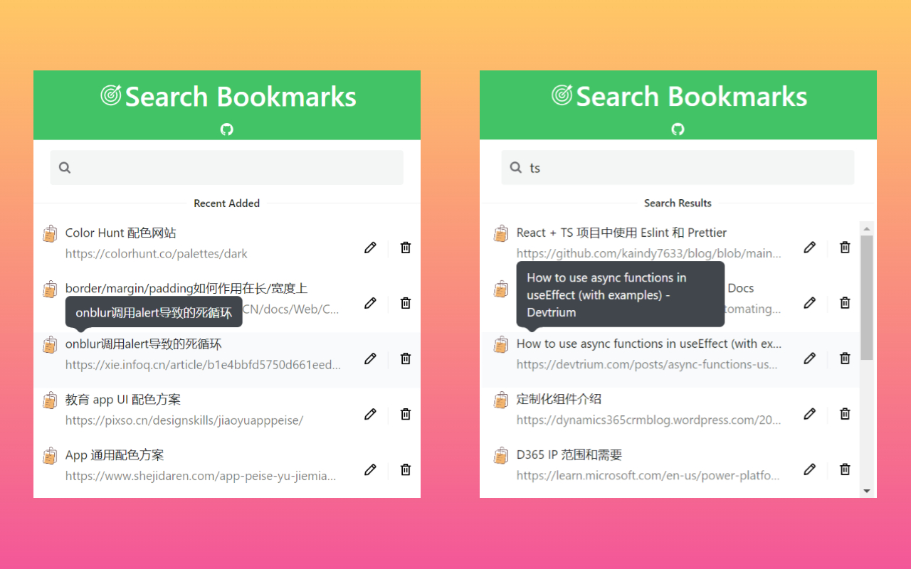
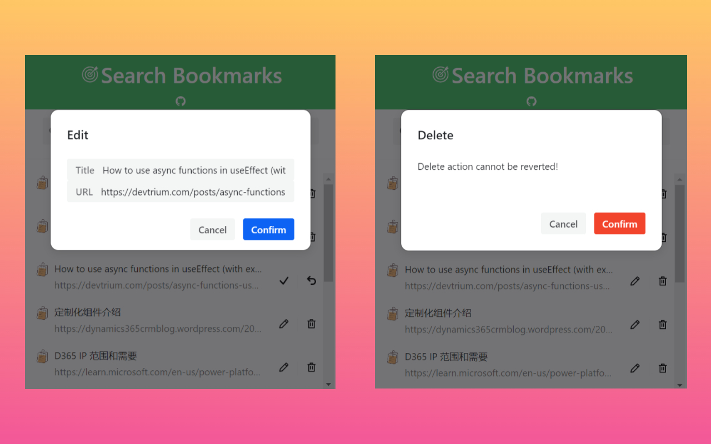

# bookmark-search

An extension for searching and manage your bookmarks.
> Bootstrapped with [Create React App](https://github.com/facebook/create-react-app) and [semi.design](https://semi.design/zh-CN)

## Installation
### For Chrome users
Install in Chrome Web Store directly: [link](https://chrome.google.com/webstore/detail/bookmark-search/dhnahdpjgnphiglnbijfoafjdokkbclk)

### For Edge users
> Refer to [Microsoft official doc](https://support.microsoft.com/en-us/microsoft-edge/add-turn-off-or-remove-extensions-in-microsoft-edge-9c0ec68c-2fbc-2f2c-9ff0-bdc76f46b026) 
1. In Edge, go to the [Chrome Web Store](https://chrome.google.com/webstore/detail/bookmark-search/Fdhnahdpjgnphiglnbijfoafjdokkbclk) .
2. Select Allow extensions from other stores in the banner at the top of the page, then select Allow to confirm.
3. Go to [bookmark-search install page](https://chrome.google.com/webstore/detail/bookmark-search/dhnahdpjgnphiglnbijfoafjdokkbclk) and select Add to Chrome.

## Overview

## Release
| Version | Description | PR | Note |
| ------ | ------ | ------ | ------ |
| v1.3.0 | auto focus input after initial load | https://github.com/hj24/bookmark-search/pull/17 ||
| v1.2.2 | optmize doc | https://github.com/hj24/bookmark-search/pull/16 ||
| v1.2.1 | fix bug, filter folder correctly for imported bookmarks | https://github.com/hj24/bookmark-search/pull/15 | Issue: https://github.com/hj24/bookmark-search/issues/9 |
| v1.2.0 | support shortcut (Ctrl/Command + Shift + S) to open extension popup | https://github.com/hj24/bookmark-search/pull/13 | Issue: https://github.com/hj24/bookmark-search/issues/12 |
| v1.1.0 | support real time search on input change | https://github.com/hj24/bookmark-search/pull/8 | Issue: https://github.com/hj24/bookmark-search/issues/10 |
| v1.0.0 | refactor UI theme | https://github.com/hj24/bookmark-search/pull/7 ||
| v0.9.0 | initial features, white-black theme | https://github.com/hj24/bookmark-search/pull/4 ||

## Development
1. `yarn fixlint`
2. `yarn test`
3. `yarn build`
4. Open the build dir in chrome extension
5. Please follow [Conventional Commits specification](https://www.conventionalcommits.org/en/v1.0.0/) to submit PR 
